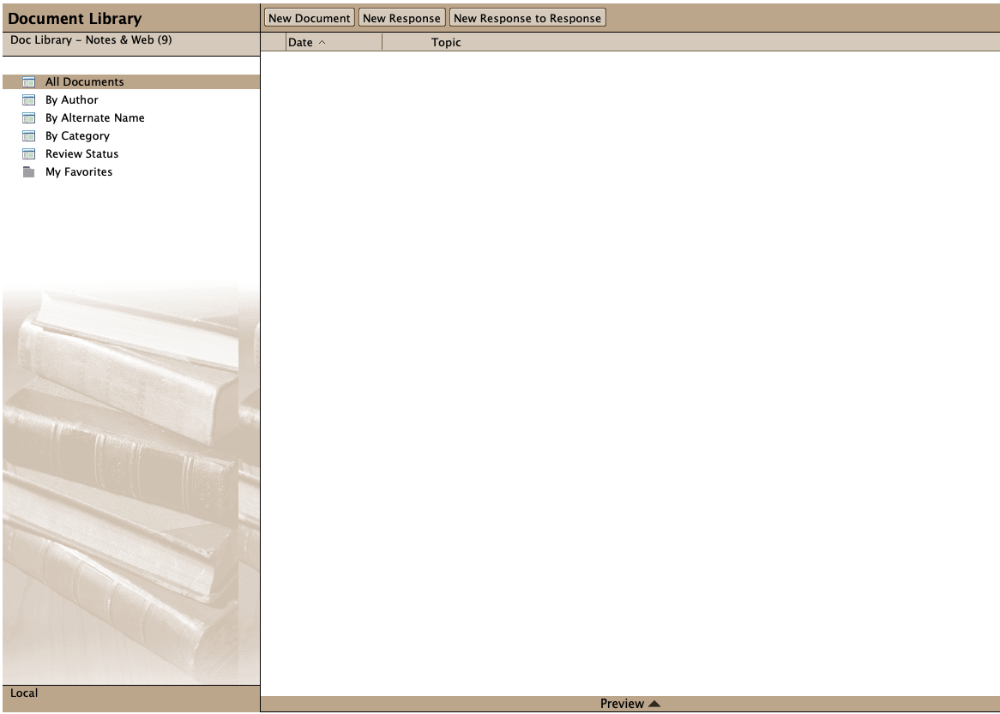

<h1>HCL Domino Doc Library - Notes & Web Template</h1>
A Document Library application is an electronic filing cabinet that stores reference documents for access by a workgroup.  The database might contain anything from environmental impact statements for a group of engineers to financial statements for a group of loan officers.

  

    Table of contents
  

  {: .text-delta }
1. TOC
{:toc}

## Info

Property | Value
---|---
Filename | doclbw7_EN.ntf
Templatename | StdR7WebDocLib
Template version | 9.0.1
Signed by | Open Source Template/Domino Development
Optimized for | Notes Client & Web

## Document Library
What does this database do?
A Document Library application is an electronic filing cabinet that stores reference documents for access by a workgroup.  The database might contain anything from environmental impact statements for a group of engineers to financial statements for a group of loan officers.

Who will use this database?
Anyone who wishes to create a record of a document or review available documents may use this database.

Important Features
- Web or Notes client: Database can be accessed from either a Web browser or a Notes Client.
- Review Cycle: Used to route a document to a series of recipients.
- Document Archiving: Used to move expired documents to an archive database.

Suggestions for Modifications
Full text search: If you wish to use Notes' full text search capabilities for a database created with this template, select menu File, Database, Properties, go to the Full Text panel and then select Create Index... to create the full text index.

Where to find more information?
More information can be found in the Using This Database document.

Access Control
Very Important:  Access level should be Author for all users of this database.  This will prevent unauthorized editing of documents within the database.  The Author fields within the forms govern who will be able to edit/review particular documents.   Errors will occur if someone with Editor access attempts to review a document when they are not an authorized reviewer of that document.  For those accessing the database from a Web browser, the database does not accept Anonymous users.

Redesigned Document Library 4.0 Databases
Sometimes, users upgrade the design of their databases using a template provided in a new release of Notes.  There is a problem with Doclib4.ntf databases which are redesigned using the Doclbw50.ntf template (users are unable to open the documents in the database).
Doclib4 users:  After you replace/refresh the design of your database using the Doclbw50 template, select Actions--"Upgrade Doclib R4 Documents to New Design".  This will run on all documents that were created with the R4 design, and upgrade them to the R4.6 design.
If you have created the Document Library using either the Doclbw46.ntf (Std46WebDocLib) or Doclbw50.ntf (StdR50WebDocLib) template, there is no need to use this agent.

## Using

This database allows you to capture and track information about documents.

Functions of the Database:

To add a document to this database: 
Click the New Document action from any of the views.

To respond to a document: 
Open a document, then click the Response action.  From a Notes Client, you can also highlight that document in a view, then click Response from there.  For Notes Client users, this creates a response to the main document in the thread.  For browser clients, this creates a response to the current document.

To respond to a response:
From a Notes Client, highlight the response you wish to respond to, then click Response to Response.  This function is performed from a browser by using the Response action, as described above.

To flag a document as Private:
You can use the "Mark Private" and "Mark Public" actions in the template to control whether anyone other than yourself can read a specific document.  For example, if you have not completed the writing of a particular document, you can click the "Mark Private" action and others will not be able to see the document.  When you complete the document, you can click the "Mark Public" action to make it available for others to read.  If a document is marked private after it has been submitted for review, the document author and the reviewers will be able to read the document.

ACL Settings

This application was designed with the intention that all users, except the manager, should have Author access.  If they have editor access, the review cycle may not function correctly.  Anonymous access is not permitted.

Features

Document Review Cycle:
The author of a document has the option of setting up a document review cycle for that document. To do so fill in the reviewers, select  review cycle options and click Submit for Review button.   
Note:  Do not use @Domain when entering reviewer names.  Any domain added may prevent the reviewer from receiving mail notifications.  Also, only enter Person-names as approvers.  Group names are not supported.

Processing Late Reviews:
If the Process Late Reviews agent is enabled, it selects those documents which are in review and have due dates which have passed.  Based on the time limit options chosen by the originator, it then either moves it along to the next reviewer, marks it as complete, or notifies the current reviewer that the review is overdue.

Archiving

Notes users only:  To set up Archiving for the Document Library, click the Archive button on the second tab of the File-Database-Properties infobox.  Fill out the information and click the OK button.  Set up the Archiving task to run on the server.  An archive database will be set up automatically.

Marking documents as "Expired"  
The Archive feature can act upon documents that have been marked as Expired.  
Notes users:  Select a document in the view and choose Mark/Unmark Expired from the Actions menu.
Web browser users:  Put the document into edit mode by clicking the Edit Document hotspot.  Then click the Mark/Unmark Expired hotspot at the top of the document.  

Deleting Documents on the Web

In the R7 template, you can now delete documents on the web while at the view level.  Click the document once to 'highlight' it and click the "Move to Trash" button.  A trash can icon will appear next to the document.  To remove the document permanently from the database, click the "Empty Trash" button.
